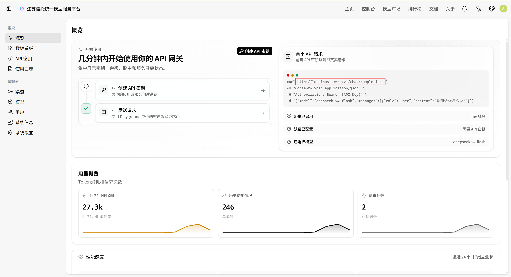
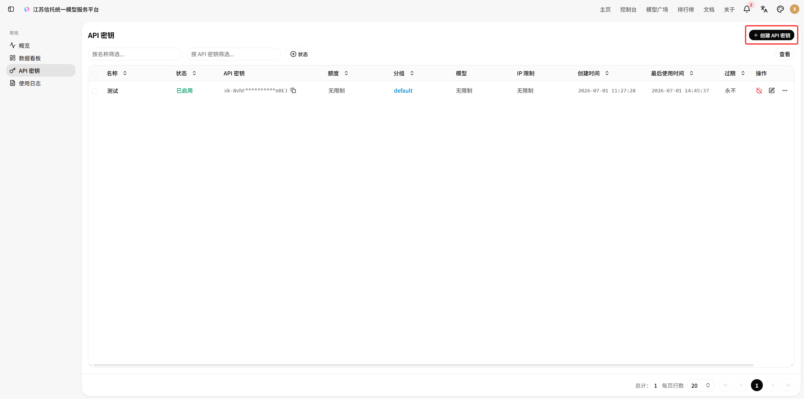
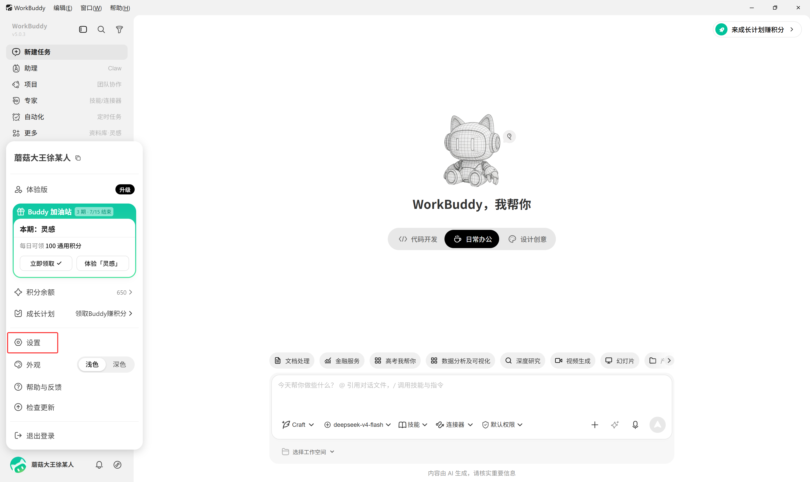
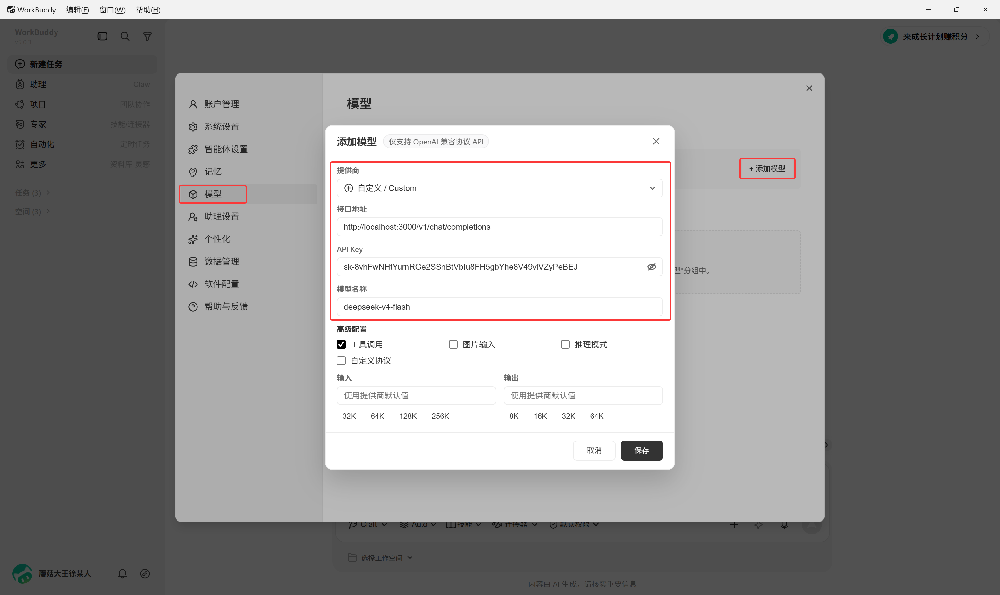
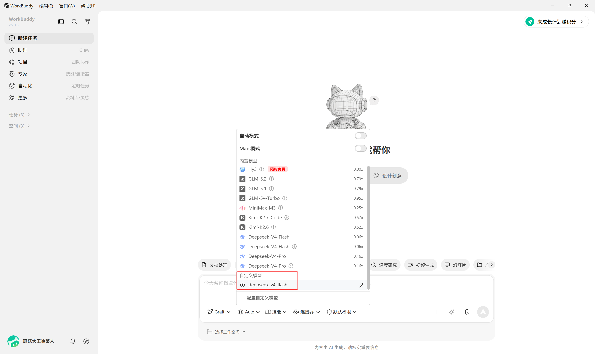

# 接入教程

接入各类Agent的教程。

## 接口地址和密钥

1. 外部工具需要接口地址和密钥来访问大模型，接口地址在概览页。

2. 调用大模型前，需要现在平台内创建个人专属密钥。

## WorkBuddy

1. 在WorkBuddy中点击左下角头像，打开设置。

2. 依次点击"模型"、"添加模型"，供应商选择"自定义"，填入接口地址、API Key、模型名称，然后保存。

   

3. 然后就可以在WorkBuddy中使用模型了。

   
